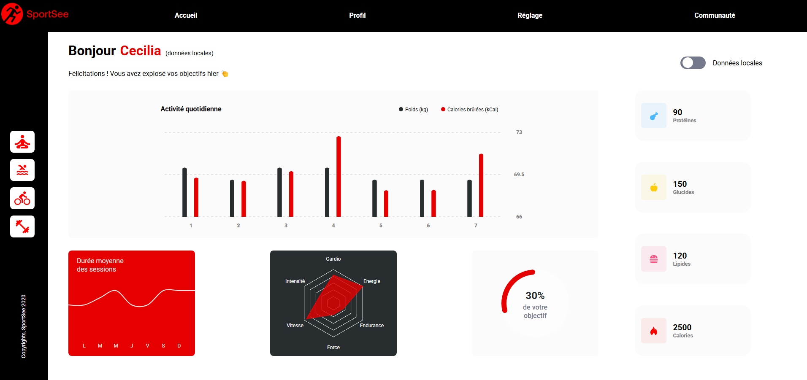

# Projet 12 - SportSee


Douzième projet de la formation OpenClassrooms : Développeur d'applications Javascript/React. <br /> <br />
Objectif : 
- Utiliser React pour construire une interface fluide et bien structurée.
- Manipuler D3 pour afficher des données sous forme de graphiques.
- Faire des requêtes API avec Fetch ou Axios pour récupérer les informations nécessaires.

## Contexte
SportSee est une plateforme de coaching sportif. <br />
L'objectif est de créer une page profil pour un tableau de bord d’analytics dédié au coaching sportif.

## Installation

Les librairies intégrées au projet sont : <br />
\- SASS <br />
\- Typescript <br />
\- Eslint <br />
\- React-Router <br />
\- Redux <br />
\- Redux Toolkit<br />
\- D3.js <br /> <br />
Pour récupérer le projet, clonez directement ce repository puis faites un ``` npm install ```. <br />

## Demo

